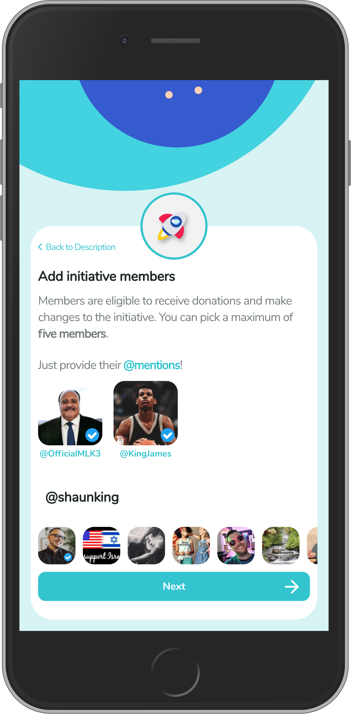
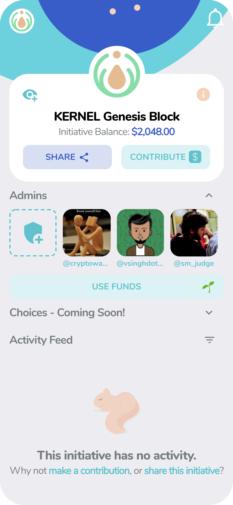
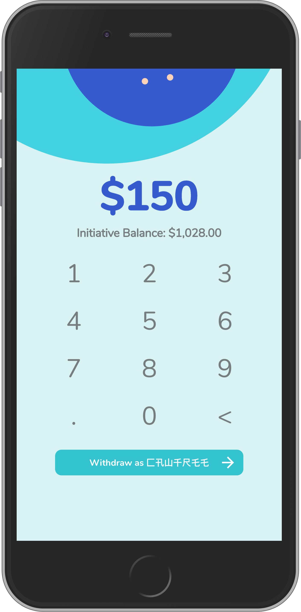

import {Appear, Notes, Head, Image} from "mdx-deck";
import {FullscreenCode, Split, SplitRight} from "mdx-deck/layouts";
import {hack} from "mdx-deck/themes";
import {CodeSurfer} from "mdx-deck-code-surfer";
import Fade from "mdx-deck-fade";
import Lottie from "react-lottie";

import {FontAwesomeIcon} from "@fortawesome/react-fontawesome";
import {
  faCrown,
  faWrench,
  faBolt,
  faHeart,
  faTv,
  faMobileAlt,
  faTimes,
  faDna
} from "@fortawesome/free-solid-svg-icons";
import {faTwitter, faGithub} from "@fortawesome/free-brands-svg-icons";

import {Layout} from "./components";
import {quine} from "./snippets";

export const theme = {
  ...hack,
  code: {...hack.code, fontWeight: 'bold'},
  link: {...hack.link, fontWeight: 'bold'},
  ul: {fontSize: '4vh'},
  p: {fontSize: '16px'},
};

<Head>
  <title>React Global Summit - React Native Web (Senior Track)</title>
</Head>

<Layout>

# React Native Web 

  <FontAwesomeIcon icon={faMobileAlt} />
  {"  ~  "}
  <FontAwesomeIcon icon={faTv} />

</Layout>

---

<Layout>
  <Lottie
    options={{
      loop: true,
      autoplay: true,
      animationData: require("./assets/lottie/react-logo.json"),
      rendererSettings: {
        preserveAspectRatio: "xMidYMid slice",
      },
    }}
    width="30vw"
    height="30vw"
  />
</Layout>

---

<Layout>
  <Lottie
    options={{
      loop: true,
      autoplay: true,
      animationData: require("./assets/lottie/dragon.json"),
      rendererSettings: {
        preserveAspectRatio: "xMidYMid slice",
      },
    }}
    width="50vw"
    height="50vw"
  />
</Layout>

---

<Layout>
  <Lottie
    options={{
      loop: true,
      autoplay: true,
      animationData: require("./assets/lottie/tetris.json"),
      rendererSettings: {
        preserveAspectRatio: "xMidYMid slice",
      },
    }}
    width="50vw"
    height="50vw"
  />
</Layout>

---

<Layout>
  <Lottie
    options={{
      loop: true,
      autoplay: true,
      animationData: require("./assets/lottie/octocat.json"),
      rendererSettings: {
        preserveAspectRatio: "xMidYMid slice",
      },
    }}
    width="50vw"
    height="50vw"
  />
</Layout>

---

<Layout>
  <Lottie
    options={{
      loop: true,
      autoplay: true,
      animationData: require("./assets/lottie/react-logo.json"),
      rendererSettings: {
        preserveAspectRatio: "xMidYMid slice",
      },
    }}
    width="30vw"
    height="30vw"
  />
</Layout>

---

<Layout>
  
</Layout>

---

<Layout>
  <CodeSurfer
    code={quine}
    lang="javascript"
    showNumbers={false}
    dark={false}
  />
</Layout>

---

<Layout>
  <Lottie
    options={{
      loop: true,
      autoplay: true,
      animationData: require("./assets/lottie/react-logo.json"),
      rendererSettings: {
        preserveAspectRatio: "xMidYMid slice",
      },
    }}
    width="30vw"
    height="30vw"
  />
</Layout>

---

<Layout>
  
    {`
 ~> <View />`}
  
</Layout>

---

<Layout>
  
    {` ~> <Text />`}
  
</Layout>

---

<Layout>
  
    {` ~> <Image />`}
  
</Layout>

---

## That kind of thing. ;-)

---

---

# Hi.

---

  
    {"> @cawfree"}
    {" "}
    <FontAwesomeIcon icon={faTwitter} />
    {" "}
    <FontAwesomeIcon icon={faGithub} />
  
  
  
    React Native Zealot™
    {" "}
    <FontAwesomeIcon icon={faMobileAlt} />
  

---

<Layout>
  <Lottie
    options={{
      loop: true,
      autoplay: true,
      animationData: require("./assets/lottie/phd.json"),
      rendererSettings: {
        preserveAspectRatio: "xMidYMid slice",
      },
    }}
    width="30vw"
    height="30vw"
  />
</Layout>

---

---

<Layout>
  <Lottie
    options={{
      loop: true,
      autoplay: true,
      animationData: require("./assets/lottie/empty.json"),
      rendererSettings: {
        preserveAspectRatio: "xMidYMid slice",
      },
    }}
    width="30vw"
    height="30vw"
  />
</Layout>

---

  
    {"> npx create-react-native-web-app"}
    {" "}
    <FontAwesomeIcon icon={faWrench} />
  

  
    {"> npx create-react-native-app"}
    {" "}
    <FontAwesomeIcon icon={faBolt} />
  

---

  <FontAwesomeIcon icon={faWrench} />

---

  <FontAwesomeIcon icon={faBolt} />

---

# 1: "Hello, World!"
(You're not mistaken. This most certainly _is_ the senior track.)

---

# 2: "What does it mean to support the web?"
(Like, specifically?)

---

  
    {"import { NativeModules } from \"react-native\";"}
    {" "}
    <FontAwesomeIcon icon={faWrench} />
  

---

  
    {"import {"}
  
  
    {"\tNativeModules as "}
    <FontAwesomeIcon icon={faTimes} />
  
  
    {"} from \"react-native-web\";"}
  

---

# Just don't do it.

---

<Layout>
  <Lottie
    options={{
      loop: true,
      autoplay: true,
      animationData: require("./assets/lottie/unicorn.json"),
      rendererSettings: {
        preserveAspectRatio: "xMidYMid slice",
      },
    }}
    width="30vw"
    height="30vw"
  />
</Layout>

---

# That was not a unicorn.

---

# That was a pony. 

---

  
    {"

"}
  

---

# 3. Mixed Imports

---

# 4. The Bundlers are Different 

  <FontAwesomeIcon icon={faDna} />

---

<Layout>
  <Lottie
    options={{
      loop: true,
      autoplay: true,
      animationData: require("./assets/lottie/burger.json"),
      rendererSettings: {
        preserveAspectRatio: "xMidYMid slice",
      },
    }}
    width="30vw"
    height="30vw"
  />
</Layout>

